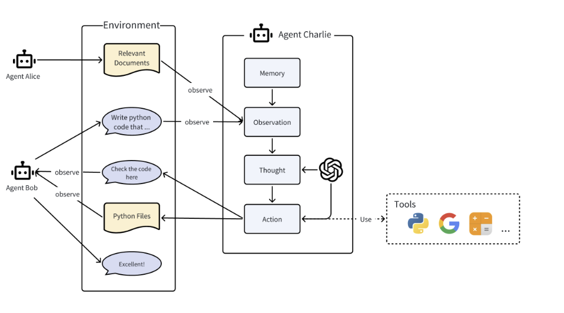

#RAG

## Dataset for My capstone
- https://huggingface.co/datasets/gbharti/finance-alpaca
- https://github.com/geniayuan/books/blob/main/CFA%202020%20Level%20II%20-%20SchweserNotes%20Book%205.pdf
- The research paper from financial institution 

## RAG reading 
[值得一看的大模型RAG全面总结：从RAG整体架构、评估方案、增强范式再到应用调研
](https://mp.weixin.qq.com/s/MOCleX6CR35UYXaYx-Q14A)： 里面对RAG 现在的研究进行总结。

- 递归检索Recursive Retrieve. 递归检索是在检索之前对查询进行拆分，并执行多次搜索以检索更多更高质量的内容的过程，例如，使用思维链(Chain-of-Thought,COT)使模型能够逐步分解查询，提供更丰富的相关知识。

- 块优化Chunk Optimization. 块优化技术是指通过调整块的大小来获得更好的检索结果。句子窗口检索是一种有效的方法，它通过获取小块文本并返回被检索片段周围的相关句子窗口来增强检索。这种方法确保了目标句子前后的上下文都包含在内，从而对检索到的信息有了更全面的理解。自动合并检索是LlamaIndex的另一种高级RAG方法，它以树状结构组织文档，父节点包含所有子节点的内容。例如，文章和段落，以及段落和句子，都遵循亲子关系。在检索过程中，对子节点的细粒度搜索最终返回父节点，从而有效地提供更丰富的信息。

[LLM（廿一）：从 RAG 到 Self-RAG —— LLM 的知识增强](https://zhuanlan.zhihu.com/p/661465330)
- self RAG 判断是否需要额外检索实时信息，
- 对db里面的relevant, irrelavent 和patial relevant进行区分

## Multi-agent Logic

- MetaGPT (the above graph)
- write report : https://docs.deepwisdom.ai/main/en/guide/use_cases/agent/researcher.html